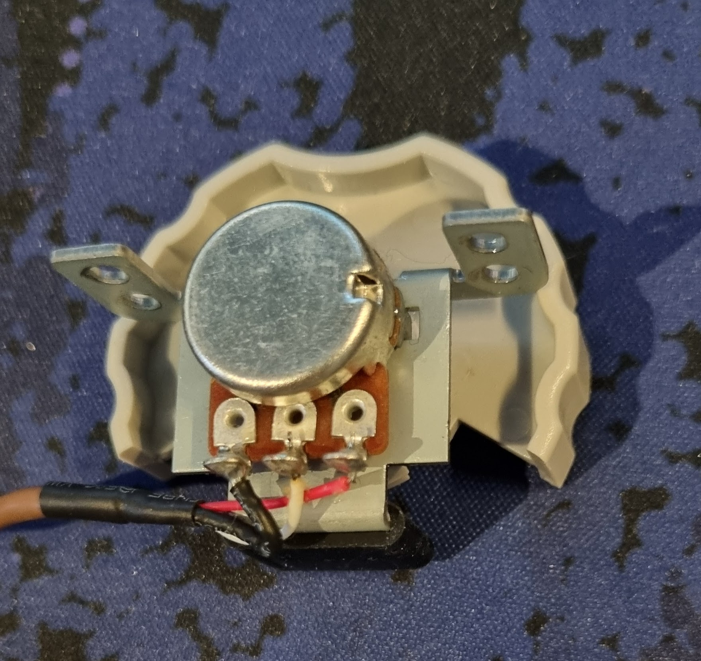
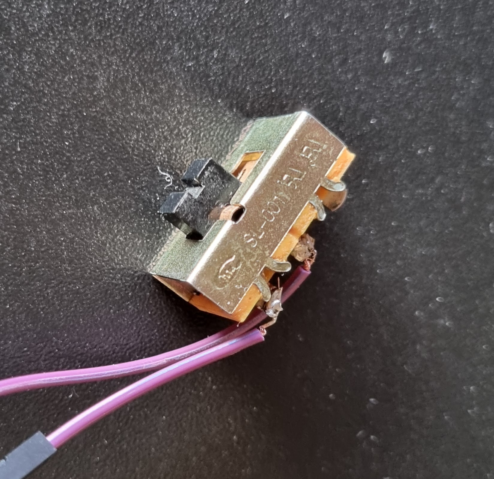
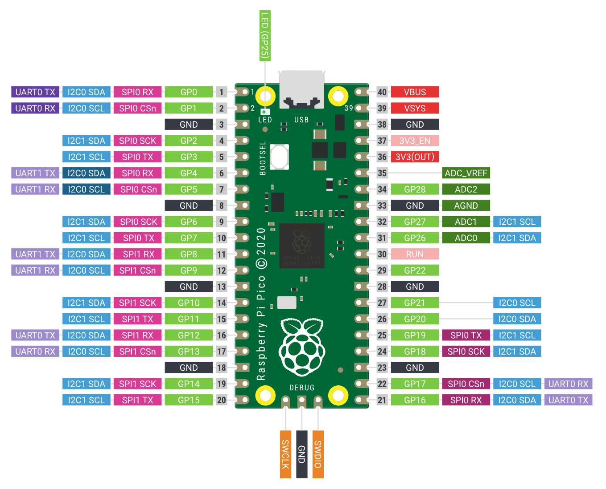

# Physical brightness adjuser for monitors

Uses RP pico to adjust brightness of monitors using a potentiometer and a simple switch to select monitor.

## Installation

### Prerequisites

#### Hardware

- 10k potentiometer
<figure>
  
  <figcaption>I use a pithch bend wheel like this. <br>The important thing is that it resets to the middle.</figcaption>
</figure>

- switch
<figure>
  
  <figcaption>I found this switch somewhere. Use whatever you want.</figcaption>
</figure>

#### Software

- [RP2040 MicroPython](https://micropython.org/)
- [Raspberry Pi Pico](https://www.raspberrypi.org/products/raspberry-pi-pico/)
- [thonny](https://thonny.org/) or any other IDE for RP pico

### Wiring

<figure>
  
  <figcaption>Wiring diagram</figcaption>
</figure>

- Connect the potentiometer to 3.3V and GND.
- Connect the middle of the potentiometer to the ADC pin of the RP pico. The code assumes 27, but you can change it.
- Connect the switch to the GPIO pin and GND. The code assumes GPIO pin 14, but you can change it.

### Usage

Using thonny or any other IDE, copy the code to the RP pico and save it as `main.py`.  
_Don't save it directly in the root of the pico. You need to use micropython's filesystem._  
After saving, the code will run automatically when the pico is connected to a power source.

Run `displayControl.py` on your computer. and you can adjust the brightness of the monitor by turning the potentiometer.  
The switch is used to select the monitor.
_Only works with two monitors._

```python

```
